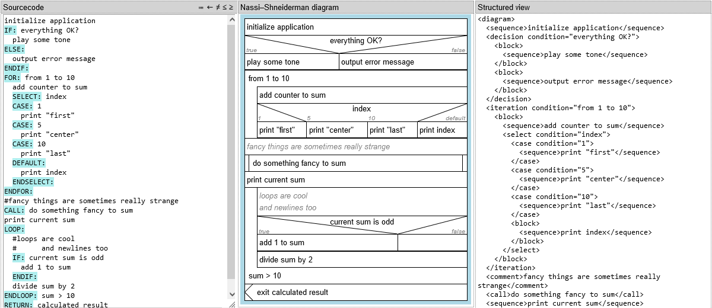

= Structogram Editor

A browser based structogram (Nassi-Shneiderman diagram) viewer (and creator)

You can type the Psdeudocode "StuctCode" in the "Sourcecode" block. The diagram
and the tree view will be updated directly.

 * The pseudecode is not desigend to be compilable.
 * One line per Diagram-Element
 * line-merging is not supported
 * Every *Command* has to be at the start of a line and
 * A Command must be upper-case.
 * Indentation is ignored.
 * "Comments" are prefixed by a hash symbol (#)
 * Multiple Comments are merged to a single Element.

== Commands

Every *Command* has to be at the start of a line and upper-case. Indentation is ignored.

`CAPTION:`::
  can be used once on diagram level to add a diagram title.

`IF:`, `ELSE:`, `ENDIF:`::
  Create an if-else-Block. write your condition in the same line
  as the `IF:` command.

`SELECT:`, `CASE:`, `DEFAULT:`, `ENDSELECT:`::
  create a "multiple branching block". The `SELECT:` and every `CASE:` should have a
  "condition" defined. The visual representation is not DIN 66261 compliant.

`FOR:`, `ENDFOR:`::
  create an iteration. No assumption is made on the text of the condition.

`LOOP:`, `ENDLOOP:`:: create a loop or iteration.
  A condition set on `LOOP:` will create a "test first loop" (iteration).
  A condition set on `ENDLOOP:` will create a "test last loop" (loop).

`REPEAT:`, `ENDREPEAT:`:: Defines an endless loop block. An optional "condition"
  can be defined after `REPEAT:` or `ENDREPEAT:` to set a "checked loop".

`CONCURRENT:`, `ENDCONCURRENT:` and `THREAD:`:: define parallel tasks
  All Sequences are treated as on task. If there are more than one sequence
  element for one task use `THREAD:` to define the start of the task. To
  start the next task use `THREAD:` again.

`CALL:`:: a call to another routine/method/function.

`BREAK:` or `RETURN:`:: a break from the current block or diagram.

Every line not starting with a _Command_ is treated as a simple _sequence_.

== Export to SVG

Under the diagram is a small 📥 Icon which will allow you to download the diagram as SVG
Image. The SVG Image should be close (99%) to what the browser will show to you.

Next to the download Icon are some options to store the source code and the
"Source Structure Tree" together with the SVG. These data is stored as "metadata"
inside the SVG file.

Beside of that you may use your browsers or OS' functions to take screenshots.

== Show Structograms on any web page

To display a Structogram as HTML in any web page only to the two files
`structoview.js` and `structoview.css` are needed. The JS will introduce the
custom elements `struct-*` and the css does the visual part. It is up to
you to create the valid ("XML"-)structure.
