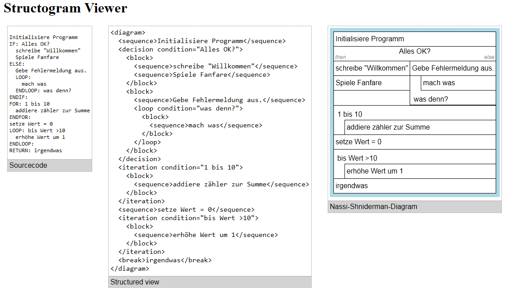

# structogramview
A browser based structogram (Nassi–Shneiderman diagram) viewer (and creator)

At this early stage you have to edit the `index.html` direktly to write the pseudecode.
The pseudecode is not desigend to be compilable. One line per Diagram-Element, line-merging
is not supported.
Every *Command* has to be at the start of a line and upper-case. Indentation is ignored.

`IF:`, `ELSE:`, `ENDIF:`
: Create an if-else-Block. write your condition in the same line
  as the `IF:` command.

`FOR:`, `ENDFOR:`
: create an iteration

`LOOP:`, `ENDLOOP:`
: create an iteration

`CALL:`
: a call to another routine/method/function

`BREAK:` or `RETURN:`
: a break from the current block.

Every line not starting with a *Command* is treated as a simple *sequence*.

TODO: Treat sequences of "*comment lines*" as a single "sequence element".
